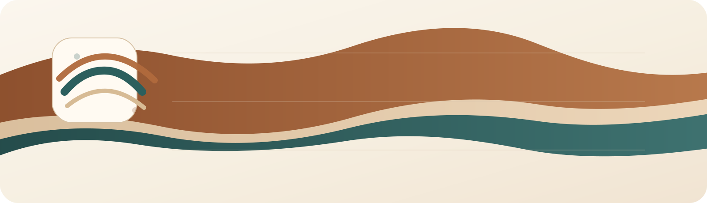

<p align="center" class="ravel-hero-image">
  
</p>

<h1 align="center">Ravel</h1>

<p align="center" class="ravel-tagline">
  <strong>RStudio-native AI copilot for serious R analysis.</strong><br />
  It sees your code, models, objects, git changes, and reporting workflow, then helps like an analyst instead of a generic chatbot.
</p>

<p align="center" class="ravel-badges">
  <a href="https://cran.r-project.org/package=ravel"></a>
  <a href="https://github.com/msaule/ravel/actions/workflows/R-CMD-check.yaml"></a>
  <a href="https://cran.r-project.org/package=ravel"></a>
  <a href="https://github.com/msaule/ravel/blob/main/LICENSE.txt"></a>
  <a href="https://github.com/msaule/ravel"></a>
  <a href="https://msaule.github.io/ravel/"></a>
</p>

<p align="center" class="ravel-actions">
  <a href="https://cran.r-project.org/package=ravel">Install from CRAN</a>
  <a href="https://msaule.github.io/ravel/">Package website</a>
  <a href="https://msaule.github.io/ravel/reference/">Reference</a>
  <a href="https://github.com/msaule/ravel/issues">Issues</a>
</p>

Ravel is not just chat inside an IDE. It is designed to behave like an analysis copilot for R users: it understands the active script, selected code, loaded objects, model outputs, git changes, and reproducible reporting workflows so it can help with real RStudio work instead of acting like a generic web chatbot.

<div class="ravel-home-grid">
<div class="ravel-home-card">
<h3>Sees real R context</h3>
<p>Understands the active editor, selected code, loaded objects, session state, plots, project files, and recent git changes.</p>
</div>
<div class="ravel-home-card">
<h3>Built for statistical work</h3>
<p>Explains lm() and glm() results, coefficients, interactions, diagnostics, model tradeoffs, and Quarto-ready reporting.</p>
</div>
<div class="ravel-home-card">
<h3>Acts safely</h3>
<p>Stages code and file changes, requires approval by default, and keeps an auditable action history.</p>
</div>
</div>

<div class="ravel-signal-strip">
<span>Active editor</span>
<span>Selected code</span>
<span>Loaded models</span>
<span>Data frames</span>
<span>Console state</span>
<span>Git diffs</span>
<span>Quarto drafting</span>
<span>Safe execution</span>
</div>

## Install

**Stable release from CRAN**
```r
install.packages("ravel")
library(ravel)
ravel::ravel_setup_addin()
```

**Development version from GitHub**
```r
if (!requireNamespace("pak", quietly = TRUE)) install.packages("pak")
pak::pak("msaule/ravel")
library(ravel)
ravel::ravel_setup_addin()
```

## Start in 60 seconds

1. Install `ravel` from CRAN.
2. Run `ravel::ravel_setup_addin()` to connect at least one provider.
3. Run `ravel::ravel_chat_addin()` in RStudio to open the chat UI.

## Why it feels different

- **Context-aware by default.** Ravel gathers the active editor, selected code, workspace objects, console state captured through Ravel actions, project files, and recent git diffs before it responds.
- **Built for statistical work.** It explains `lm()` and `glm()` results, coefficients, interactions, fit diagnostics, and common modeling pitfalls in plain English.
- **Safe when it acts.** Generated code is previewed, file edits are staged, and actions are logged instead of silently executed.
- **Designed for RStudio.** The setup flow, chat UI, and action workflow live inside RStudio addins rather than treating R as a thin wrapper around a generic chat window.
- **Multi-provider without pretending.** Ravel supports official APIs and official CLIs only, with clear messaging when a provider or auth path is unavailable.

## Showcase workflows

These are the kinds of prompts where Ravel starts feeling very different from a normal chat window.

<div class="ravel-showcase-grid">
<div class="ravel-showcase-card">
<div class="ravel-showcase-kicker">Statistical debugging</div>
<h3>Diagnose a weird glm() before you trust it</h3>
<p>Ravel sees the selected model code, the fitted object in memory, and the latest console output.</p>
<pre><code>Why do these logistic coefficients explode?
Check whether separation is plausible,
tell me what diagnostics to run next,
and draft a Quarto diagnostics subsection.</code></pre>
<p class="ravel-showcase-result">Useful when a model technically runs but the analysis feels wrong.</p>
</div>
<div class="ravel-showcase-card">
<div class="ravel-showcase-kicker">Refactoring with context</div>
<h3>Rewrite a gnarly tidyverse pipeline into base R</h3>
<p>Ravel can use the active selection, nearby script context, and project files so the rewrite matches how the rest of the analysis is written.</p>
<pre><code>Convert this dplyr pipeline to base R,
keep the same output shape,
and explain each transformation step.</code></pre>
<p class="ravel-showcase-result">Good for teaching, package work, and mixed-style codebases.</p>
</div>
<div class="ravel-showcase-card">
<div class="ravel-showcase-kicker">Results writing</div>
<h3>Turn a fitted model into a report section</h3>
<p>With a model object in memory, Ravel can help draft prose, interpretation, and chunk scaffolding that matches the current analysis.</p>
<pre><code>Write a results section from this model,
explain the interaction in plain English,
and include a Quarto chunk for follow-up plots.</code></pre>
<p class="ravel-showcase-result">Especially strong when you already have lm() or glm() objects loaded.</p>
</div>
<div class="ravel-showcase-card">
<div class="ravel-showcase-kicker">Code review for analysts</div>
<h3>Use git-aware context to review an analysis diff</h3>
<p>Ravel reads the workspace git state and recent diffs, then helps reason about whether a change is cosmetic, risky, or statistically meaningful.</p>
<pre><code>Summarize what changed in this analysis,
tell me which edits could change results,
and suggest a validation checklist before merge.</code></pre>
<p class="ravel-showcase-result">Helpful when you want a reviewer that understands both code and analysis intent.</p>
</div>
<div class="ravel-showcase-card">
<div class="ravel-showcase-kicker">Interpretation help</div>
<h3>Explain factor levels and interactions without hand-waving</h3>
<p>Ravel can inspect model summaries and object structure, then translate coefficient tables into plain language that is actually usable.</p>
<pre><code>Explain these coefficients like I have to present them.
What is the reference group?
How does the interaction change the main-effect interpretation?</code></pre>
<p class="ravel-showcase-result">Ideal for teaching, presentations, and cleaning up methods/results language.</p>
</div>
<div class="ravel-showcase-card">
<div class="ravel-showcase-kicker">Analysis rescue</div>
<h3>Recover from an ugly error with the real workspace in view</h3>
<p>Instead of pasting fragments into a browser tab, you can keep the active script, objects, and recent output attached to the same conversation.</p>
<pre><code>Why is this join failing right now?
Use the selected code and loaded objects,
then propose the smallest safe fix.</code></pre>
<p class="ravel-showcase-result">This is where the RStudio-native workflow matters most.</p>
</div>
</div>

## What Ravel sees right away

- Active editor contents and selected code
- Loaded objects, including data frames, formulas, and fitted models
- Ravel-managed console output and current session details
- Project files, working directory, and package context
- Workspace and editor git state, including recent diffs

## What it helps with

- Explain selected R code and debugging errors
- Interpret model summaries, coefficients, interactions, and diagnostics
- Compare modeling choices and suggest next checks
- Refactor tidyverse and base R code in either direction
- Draft Quarto methods, results, and diagnostics sections
- Preview code and file actions before applying them

## Built for people doing real R work

- Analysts working in RStudio on scripts, reports, and iterative modeling
- Students learning how code, model output, and interpretation connect
- Researchers writing Quarto or R Markdown from live analysis objects
- Data science teams reviewing analytical changes, not just syntax
- Anyone who wants safer execution than copy-pasting from a browser chatbot

## Provider support

Ravel is explicit about what is supported today and what is still constrained by official provider boundaries.

| Provider | Status | Auth paths in Ravel | Notes |
| --- | --- | --- | --- |
| OpenAI API | Implemented | API key | Implemented against OpenAI HTTP APIs. |
| OpenAI Codex / ChatGPT | Working | Codex CLI sign-in, API key fallback | Ravel can use the official Codex CLI as a login-first OpenAI path, and can fall back to it automatically when the API path is rate-limited in `auto` mode. |
| GitHub Copilot | Working | Copilot CLI OAuth/device flow, GitHub CLI OAuth token | Ravel uses the official standalone Copilot CLI. It can authenticate via `copilot login` or supported GitHub tokens such as the OAuth token from `gh auth`. |
| Gemini | Implemented for API key, OAuth-ready abstraction | API key, bearer token/OAuth-style token slot | API-key flow is implemented. OAuth is represented in the auth abstraction so the provider boundary stays clean. |
| Anthropic | Implemented | API key | Official API-key auth only. No consumer-login mode is claimed. |

## Safety defaults

- No silent code execution by default
- No silent file edits by default
- Explicit previews and approvals
- Structured history for actions and conversations, stored in session memory by default
- Honest provider and auth messaging
- Statistical caveats when assumptions or limitations are visible

Non-sensitive settings and history stay in session memory by default, so Ravel
does not write into a user's home filespace unless storage paths are configured
explicitly through `options(ravel.user_dirs = list(config = "<path>", data = "<path>"))`.

## Learn more

- CRAN package page: <https://cran.r-project.org/package=ravel>
- Package website: <https://msaule.github.io/ravel/>
- Showcase article: <https://msaule.github.io/ravel/articles/ravel-showcase.html>
- [ARCHITECTURE.md](ARCHITECTURE.md) explains the layers and execution model.
- [ROADMAP.md](ROADMAP.md) lays out the planned phases beyond the MVP.
- [CONTRIBUTING.md](CONTRIBUTING.md) explains the developer workflow and release checks.
- [RELEASING.md](RELEASING.md) captures the CRAN and R-universe release path.
- [CODE_OF_CONDUCT.md](CODE_OF_CONDUCT.md) describes community expectations.
- [AGENTS.md](AGENTS.md) describes collaboration conventions for contributors and coding agents.

## For contributors

If you are developing on the repository locally, prefer:

```r
devtools::load_all(".")
```

Use `devtools::install(".")` only when you specifically need the installed
package. Full release and submission details live in [RELEASING.md](RELEASING.md).

## References

The auth and provider boundaries in this project follow official documentation:

- OpenAI Codex CLI: <https://developers.openai.com/codex/cli>
- OpenAI API auth: <https://developers.openai.com/api/reference/overview>
- GitHub CLI `gh copilot`: <https://cli.github.com/manual/gh_copilot>
- Gemini API docs: <https://ai.google.dev/gemini-api/docs>
- Anthropic API docs: <https://docs.anthropic.com/en/api>
